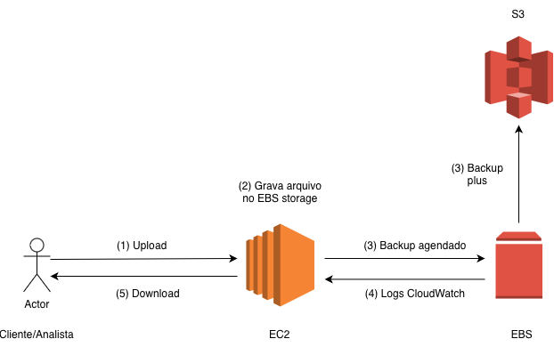
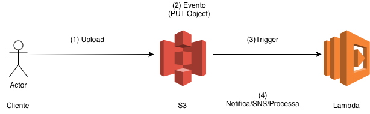

# Desafio AWS Practitioner DIO - Arquiteturas Simples

Este repositório apresenta dois exemplos práticos de arquiteturas AWS comuns no mercado financeiro, abordando tanto armazenamento seguro quanto automação de processamento. A proposta é documentar, de forma clara e objetiva, como esses fluxos funcionam e porque são utilizados.

---

## 💡 Cenário 1: Central Financeira com Upload Seguro, Backup e Logs

### (EC2 + EBS + S3)

Este fluxo simula um ambiente em que analistas ou clientes enviam documentos (como relatórios ou comprovantes) para processamento e armazenamento seguro, com backups automáticos e monitoramento.

**Passos do fluxo:**

1. **Upload:** O cliente ou analista faz upload de arquivos via uma aplicação hospedada numa instância EC2.
2. **Persistência:** O arquivo é gravado imediatamente num volume EBS associado à EC2, garantindo alta performance no acesso.
3. **Backup:** Um processo agendado realiza backups recorrentes dos arquivos do EBS direto para um bucket S3, garantindo retenção, durabilidade e conformidade.
4. **Logs:** Todas as operações – uploads, downloads, backups, acessos – geram registros no AWS CloudWatch, facilitando auditoria e rastreabilidade.
5. **Download:** O arquivo pode ser baixado pelo cliente ou analista, sempre que necessário, garantindo disponibilidade controlada.

**Diagrama:**  

**Vantagens desse padrão:**

- Atende requisitos de compliance financeiro (retenção, rastreabilidade, logs)
- Facilidade de restauração em cenários de falha (backup em S3)
- Controle de acessos e monitoramento centralizado

---

## 💡 Cenário 2: Processamento Automático e Notificações

### (S3 + Lambda)

Este fluxo mostra uma automação muito comum em bancos e fintechs: quando clientes enviam documentos (comprovantes, notas fiscais, planilhas) para o S3, o processamento acontece automaticamente sem intervenção humana.

**Passos do fluxo:**

1. **Upload:** O cliente faz upload de um arquivo para o bucket S3 usando o app ou site.
2. **Evento S3:** O upload dispara um evento (PUT Object), que aciona imediatamente uma função Lambda.
3. **Trigger Lambda:** A função Lambda processa o arquivo recebido, podendo validar dados, extrair informações, transformar formatos, ou realizar infraestrutura auxiliar.
4. **Notificação/Processamento:** Lambda pode enviar notificações via SNS, gravar logs, retornar integrações ou registrar as ações processadas.

**Diagrama:**  

**Vantagens desse padrão:**

- Reduz trabalho manual, acelera processos e diminui fraudes
- Totalmente escalável, adaptando-se ao volume crescente de arquivos
- Facilita integrações com outras soluções (SNS, banco de dados, outros buckets)

---

## 📑 Como rodar/consultar

- Os diagramas podem ser visualizados na pasta `/images`
- O fluxo pode ser implementado na AWS usando o painel web ou CLI (consulte a documentação recomendada)

---

## 📚 Referências

- [Documentação AWS Practitioner](https://docs.aws.amazon.com/pt_br/toolkit-for-visual-studio/latest/user-guide/tkv-ec2-ami.html)
- [AWS Lambda Docs](https://docs.aws.amazon.com/lambda/latest/dg/welcome.html)
- [Amazon S3 Docs](https://docs.aws.amazon.com/AmazonS3/latest/userguide/Welcome.html)
